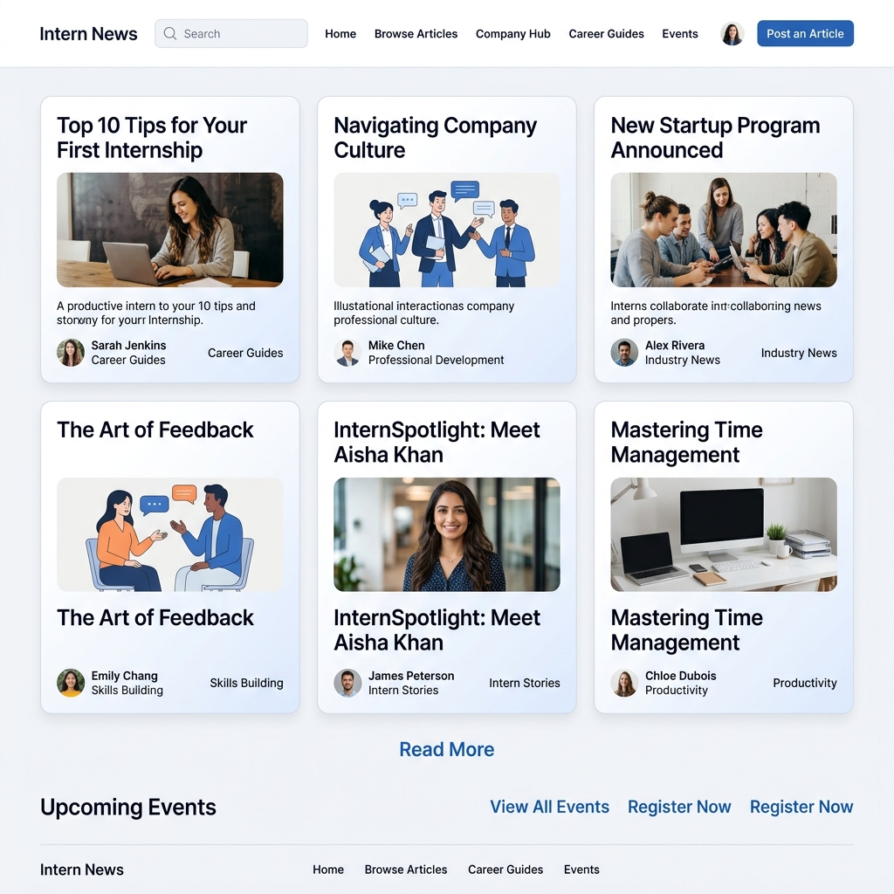
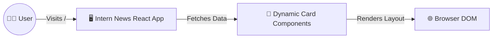

<div align="center">
  
  <h1>✨ Intern News Platform ✨</h1>
  <p>A beautifully curated, blazingly fast News Portal Frontend engineered exclusively with modern built-in React 19 capabilities.</p>

  <!-- Badges -->
  <p>
    
    
    
    
  </p>
</div>

---

## 🌟 Overview

Welcome to **Intern News**. Content consumption is fundamentally based on clean readability and fast load times. This project focuses exclusively on creating an elegant, crisp, light-themed frontend portal for aggregating daily news and intern-focused articles. Utilizing the absolute latest React 19 tooling wrapped in Vite's sub-second HMR guarantees a developer experience as smooth as the user experience.

## 🚀 Key Features

* **Lightning Fast:** Built with Vite and React 19 for instantaneous chunk loading and compilation.
* **Pristine Aesthetics:** Strictly adheres to a sleek white and navy theme, boasting subtle gradients and interactive hover-states.
* **Component-Driven:** Modular card elements built elegantly without cluttering UI logic.
* **Fully Responsive:** CSS Grid configurations intelligently reorganize article layouts from ultrawide desktops down to mobile viewports.
* **Linted Codebase:** Pre-configured with ESLint v9 ensuring impeccable code quality standards.

---

## 🛠️ Technology Stack

No unnecessary bloat or massive external libraries. Fast, reliable, readable standard tools:
* **UI Library:** React 19 + React DOM
* **Build System:** Vite v7
* **Quality Assurance:** ESLint, Prettier integrations
* **Styling:** Custom Vanilla CSS Grid workflows leveraging variables (`#f0f4f8` / `#1a202c`)

---

## 🏗️ System Design 



---

## 🚦 Getting Started

### Prerequisites
* [Node.js](https://nodejs.org/) installed 

### Installation & Run Instructions

```bash
# Clone the repository
git clone https://github.com/shreyas-bhandari/intern-news.git

# Enter the project directory
cd intern-news

# Install modern dependencies
npm install

# Start the blazingly fast Vite development server!
npm run dev
```

---

<div align="center">
  <b>Engineered with ❤️ for the next generation of readers.</b>
</div>
